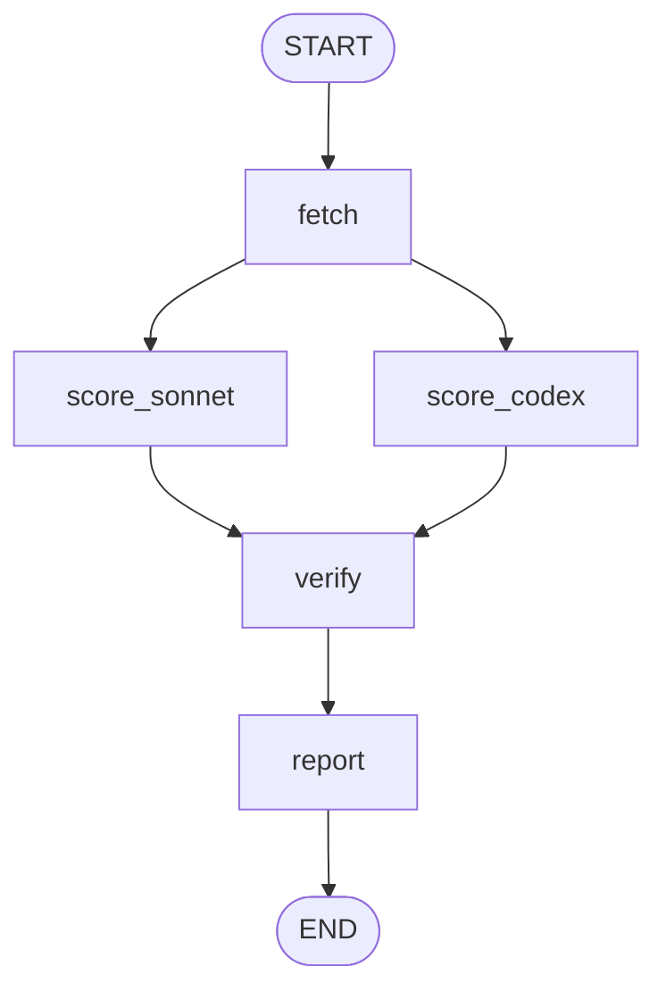

# Patent Hunter

> Find commercially viable expired US patents — automatically, with two LLMs cross-checking each other.

[](LICENSE)
[](https://github.com/katsuyukishimbo/patent-hunter/actions/workflows/test.yml)


There are **4.2M+ expired US utility patents** sitting in the public domain. Each one is essentially a free manufacturing manual — dimensions, tolerances, materials, assembly — written when someone thought it was worth $15,000 in legal fees to protect. Nobody re-reads them. Patent Hunter does.

Every week, it pulls the latest grants, filters by category, and asks **Claude (via local CLI / Max subscription)** and **OpenAI Codex** — independently — whether the underlying invention is commercially viable today. Only the rows where both judges agree are surfaced.

## Features

- **Dual independent scoring** with Claude (via local CLI / Max subscription) and Codex. Codex never sees Claude's score (Clean Context for Verifier).
- **~90% deterministic / ~10% LLM.** Fetch, filter, formatting and IO are plain Python; the LLM is only asked for the commercial-viability judgement.
- **Continuous evaluation harness** with a golden dataset and four metrics (agreement, in-range, status-match, sigma).
- **LangGraph orchestration** with `MemorySaver` checkpoint and parallel fan-out of the two scorers.
- **Edge API in Hono** for triggering runs, streaming logs (SSE), and accepting Discord interactions (Ed25519 verified).
- **One HTML report per week** under `out/<ISO-week>/` — patent links, BOM estimate, Amazon gap analysis, and consensus score.

## Quickstart

```bash
# Clone and install (Python 3.11+)
git clone https://github.com/katsuyukishimbo/patent-hunter.git
cd patent-hunter
python3 -m venv .venv && .venv/bin/pip install -e ".[dev]"

# Try it without any API key (uses fixture data)
python3 scripts/dryrun.py
open out/2026-W19/report.html
```

That's the full loop. The dry run uses stubbed scorers, so no spend, no network.

## Setup

For live weekly runs, Patent Hunter fetches USPTO grants from Google Patents
Public Datasets in BigQuery.

1. Create or choose a GCP project with BigQuery billing/free-tier access.
2. Enable the BigQuery API for that project.
3. Authenticate local ADC:
   ```bash
   gcloud auth application-default login
   ```
4. Install and authenticate the local Claude Code CLI for the "Sonnet" judge:
   ```bash
   npm install -g @anthropic-ai/claude-code
   # or: brew install anthropic/tap/claude-code
   claude /login
   ```
   Patent Hunter uses your local Claude Code installation (`claude` CLI) for the
   "Sonnet" judge. No API key is required.
5. Copy `.env.example` to `.env`, then set:
   ```bash
   GOOGLE_CLOUD_PROJECT=<your-project-id>
   ```
6. Optional service-account fallback: set `GOOGLE_APPLICATION_CREDENTIALS` to
   a JSON key path when ADC is not available.

### Continuous Integration

- `.github/workflows/test.yml` runs unit tests and TypeScript typecheck
  on every push/PR to `main`. LLM components remain mocked here so the
  CI does not depend on Claude CLI / Codex CLI being installed on the
  runner.
- `.github/workflows/integration.yml` is **manual-only** (`workflow_dispatch`).
  It runs `tests/integration/` against a real BigQuery project. Required
  repository secrets:
  - `GCP_SA_KEY_JSON`: service account JSON with `BigQuery Data Viewer`
    on `bigquery-public-data` / read access for `patents-public-data`.
  - `GCP_PROJECT_ID`: the GCP project ID that holds the BigQuery quota.

Set these via `gh secret set GCP_SA_KEY_JSON < sa-key.json` and
`gh secret set GCP_PROJECT_ID -b "patent-hunter-2026"`.

### Discord notifications (optional)

To receive a weekly summary in Discord, create a webhook in your channel:

1. Channel Settings → Integrations → Webhooks → New Webhook
2. Copy the URL (format: `https://discord.com/api/webhooks/<id>/<token>`)
3. Add to your `.env`:
   ```
   DISCORD_WEBHOOK_URL=https://discord.com/api/webhooks/...
   ```

Each weekly run posts the top adopted patents as a Discord Embed. Failures
to notify do not affect the run itself (best-effort).

### DIY mode (3D プリント可能なものだけ採用)

Patent Hunter now asks both scoring models for Japanese presentation fields
(`short_title_ja`, `summary_ja`, `opportunity_ja`) and a 3D-printability
judgement. Reports and Discord notifications show the Japanese title/summary,
market opportunity, and a 🔧 badge when a patent looks practical for an
individual desktop FDM printer.
Each scored patent also includes `next_action_steps_ja`: three concrete
Japanese next steps for either 3D-print/Etsy validation or Alibaba/FBA OEM.

Use `--diy-only` to adopt only patents where both models return
`diy_friendly=true`:

```bash
python3 -m patent_hunter run --week 2026-W19 --diy-only

# Fixture path, no network/API calls
python3 scripts/dryrun.py --diy-only
```

JPY material-cost display uses a fixed default exchange rate of 150 JPY/USD.
Override it for notifications with `USD_JPY_RATE`, for example
`USD_JPY_RATE=155 python3 scripts/dryrun.py`.

### Weekly cron (macOS launchd)

To have Patent Hunter run automatically every Monday at 09:00:

1. Render the launchd plist template with your project path:

   ```bash
   PROJECT_DIR="$(pwd)"
   sed "s|{{PATENT_HUNTER_DIR}}|$PROJECT_DIR|g" \
     deploy/launchd/com.patenthunter.weekly.plist.template \
     > ~/Library/LaunchAgents/com.patenthunter.weekly.plist
   ```

2. Load the agent:

   ```bash
   launchctl load ~/Library/LaunchAgents/com.patenthunter.weekly.plist
   ```

3. Verify it registered:

   ```bash
   launchctl list | grep patenthunter
   ```

Each run writes `logs/weekly-YYYY-Wnn.log` (one per ISO week). The wrapper
script `scripts/run_weekly.sh` unsets any inherited
`GOOGLE_APPLICATION_CREDENTIALS` (so a different workspace's service account
does not get reused), loads `.env`, and invokes `python -m patent_hunter run`.

To unload:

```bash
launchctl unload ~/Library/LaunchAgents/com.patenthunter.weekly.plist
```

#### Linux / other Unix (cron)

```cron
0 9 * * 1 /path/to/patent-hunter/scripts/run_weekly.sh >/dev/null 2>&1
```

#### Headless server

The `claude` CLI needs interactive `claude /login` to bind to a Claude Max
subscription. On servers without a browser, switch the Sonnet scorer to the
Anthropic Python SDK with an API key — see the docstring at the top of
`src/patent_hunter/scorers/sonnet.py` for the swap point.

## Usage

```bash
# Set credentials for live fetching + scoring
cp .env.example .env       # then edit: GOOGLE_CLOUD_PROJECT; ensure `claude /login`

# Score the previous ISO week
python3 -m patent_hunter run

# Score a specific week, top 10 results
python3 -m patent_hunter run --week 2026-W19 --top-n 10

# Stop after a completed batch if estimated spend exceeds the guardrail
python3 -m patent_hunter run --week 2026-W19 --max-cost 10.0

# Run via LangGraph instead of the linear CLI
.venv/bin/python -m patent_hunter.graph.cli --week 2026-W19 --dryrun --max-cost 10.0

# Evaluate the pipeline against the golden dataset
python3 evals/run_eval.py
```

Outputs land under `out/<ISO-week>/`:

```
report.html     one-page summary, opens in any browser
scores.jsonl    every patent x every model (debugging)
run.log         token counts, estimated cost, wall time
events.jsonl    structured operational events, one JSON object per line
```

Sample CLI output:

```
fetched=4 scored=4 adopted=3
sonnet_input_tokens=1500 output_tokens=600 cli_reported_cost=$0.0135
codex_invocations=1 cost_estimate=$0.30
total_cost=$0.3135
```

A real weekly run consumes Claude Max quota through the local CLI and records
the CLI-reported usage cost for visibility; no Claude API key billing is used.

### Observability

Each run writes `out/<ISO-week>/events.jsonl` alongside the existing human
readable `run.log`. The JSONL stream is append-only and is intended for
`grep`, `jq`, and simple weekly aggregation. Events include `run_started`,
`fetch_started`, `fetch_done`, `fetch_retry`, `score_started`, `score_retry`,
`score_done`, `budget_warning`, `budget_exceeded`, and `run_done`.

`--max-cost` defaults to `$10.00`. The runner checks the accumulated estimated
cost after each completed scoring batch. At 80% of the budget it emits
`budget_warning`; above the budget it emits `budget_exceeded`, writes the
partial `report.html` / `scores.jsonl` / `run.log`, and exits with an error.

### Edge API

The repo also ships a Hono server that wraps the Python pipeline as HTTP endpoints (compatible with Cloudflare Workers):

```bash
cd web
npm install
npm run dev
# -> http://localhost:8787

curl http://localhost:8787/api/patents/top?n=3
curl http://localhost:8787/api/eval/latest
```

Endpoints: `GET /api/patents/top`, `GET /api/eval/latest`, `POST /api/eval/run`, `POST /api/scoring/run`, `GET /api/scoring/stream/:week` (SSE), `POST /api/discord/interactions`.

## How it works



| Node | Responsibility |
|---|---|
| `fetch` | Google Patents BigQuery query, CPC-prefix filter, then a deterministic "likely lapsed" grant-window approximation. |
| `score_sonnet` | Launches `claude -p ... --output-format=json` as a subprocess from `/tmp`, matching the Codex subprocess pattern while avoiding project-context ingestion. |
| `score_codex` | OpenAI Codex via subprocess. Does **not** see Sonnet's score. |
| `verify` | Adopt only where `sonnet.score >= 7` **and** `codex.score >= 7`. |
| `report` | Emit `report.html` + `scores.jsonl` + `run.log`. |

### Prompt engineering techniques (research-backed)

The scorers combine three research-backed techniques to reduce
hallucinations and false-positive adoptions:

1. **Counterfactual Anchoring** (Tversky & Kahneman 1974)
   The LLM lists 5 reasons the patent would FAIL commercially before
   scoring, breaking the inertia toward inflated scores.

2. **Self Pre-Mortem** (Klein 2007, *Harvard Business Review*)
   The LLM imagines the patent launched and failed in 6 months, then
   enumerates the top 5 failure causes and a mitigation for each.

3. **Calibrated Confidence Prompting**
   Every numeric field returns alongside a 0–100 confidence. Use
   `--min-confidence 70` to filter out adopted patents that the model
   itself is uncertain about.

### Continuous prompt improvement (live eval)

`scripts/dryrun.py` runs against deterministic stubs by default. To benchmark
the actual scoring prompt against the golden dataset, run it through the
real Claude CLI and Codex CLI:

```bash
python scripts/dryrun.py --live          # one fixture run through real CLIs
python evals/run_eval_live.py            # 3 runs + Sierra metrics → evals/out/eval_live_<ts>/
```

The live eval consumes the Claude Max / ChatGPT Pro subscription quotas, not
API credits. It's the entry point for autoresearch-style prompt improvement
loops: edit `src/patent_hunter/scorers/prompts.py`, re-run the live eval,
keep changes only when metrics improve.

## Roadmap

Patent Hunter is built as a **self-improving system**, not a one-shot
script. Phases 1–2 are the foundation (a weekly run that produces
high-signal output). Phases 3 and onward close the feedback loop so the
pipeline gets better without manual prompt tuning.

### Phase 1–2: Foundation (✅ shipped)

| Status | Capability |
|:-:|---|
| ✅ | Python CLI (fetch + dual-model scoring + HTML report) |
| ✅ | Evaluation harness (golden dataset, 4 metrics, regression detection) |
| ✅ | LangGraph orchestration (parallel fan-out, `MemorySaver` checkpoint) |
| ✅ | Hono Edge API (REST + SSE + Discord webhook) |
| ✅ | Production robustness (retry, partial-failure tolerance, `--max-cost`) |
| ✅ | Structured events stream (`out/<week>/events.jsonl`) |
| ✅ | Weekly cron deployment (macOS launchd template) |
| ✅ | GitHub Actions CI (unit + integration via workflow_dispatch) |
| ✅ | Japanese localisation + 3D-printability scoring |
| ✅ | Per-patent "next action steps" for DIY / OEM routes |
| ✅ | Research-backed prompt techniques (Counterfactual Anchoring, Self Pre-Mortem, Calibrated Confidence) |

### Phase 3: Self-improving loop (planned)

| ID | Capability |
|---|---|
| 3.0 | **Self-eval dashboard** — aggregate `events.jsonl` across weeks into a single HTML page (adoption rate, agreement rate, cost trend, DIY ratio). |
| 3.1 | **Feedback loop** — a Discord bot reads 👍 / 👎 reactions on adopted patents and writes them to `feedback.jsonl`. Monthly rollups feed the golden dataset. |
| 3.2 | **Auto-improvement agent** — a monthly Claude Code session reads metrics + feedback and opens a GitHub PR proposing prompt / category / threshold changes. Reviewer (human) merges. |
| 3.3 | **Continuous eval + auto-revert** — every proposed change runs against `evals/cases.json`; regressions auto-revert via CI. |
| 3.4 | **Schedule agent** — integrate the `autoresearch` Karpathy-style loop so improvements compound without manual intervention. |

### Phase 3.5: Ecosystem (planned)

| ID | Capability |
|---|---|
| 3.5.1 | **Custom MCP server** — expose `patent_search` / `score_patent` / `simulate_listing` as Model Context Protocol tools so Claude Desktop, Cursor, and other clients can use Patent Hunter as a primitive. |
| 3.5.2 | **Anthropic Skills package** — bundle the scoring prompt + few-shot examples as a Claude Code skill installable via `claude /skills install patent-hunter`. |
| 3.5.3 | **Spec-driven development** — `docs/specs/` carries machine-checkable specs; an LLM generates tests from each spec. |
| 3.5.4 | **Architecture Decision Records** — see [`docs/adr/`](docs/adr/). |

### Phase 4: Intelligence (planned)

| ID | Capability |
|---|---|
| 4.1 | **Vision LLM on patent figures** — score the drawings as well as the text. |
| 4.2 | **GraphRAG over citations** — use the patent citation graph to detect "really dead" inventions vs ones with active follow-on filings. |
| 4.3 | **Vector similarity over past adoptions** — pgvector retrieves "what looked like this and how it performed". |
| 4.4 | **Knowledge distillation** — train a small Haiku-grade scorer on the dual-model history, cutting cost ~10x. |
| 4.5 | **Computer Use agent** — automate Amazon listing research and Alibaba RFQ submission. |

### Phase 5: Monetisation hand-off (planned, optional)

| ID | Capability |
|---|---|
| 5.1 | Amazon SP-API listing draft generator. |
| 5.2 | Etsy receive-on-demand integration for the DIY route. |
| 5.3 | Auto STL generation + Printables / BOOTH publishing for sellable models. |

### Autonomous issue + auto-triage

Patent Hunter generates its own GitHub issues each week and triages new
issues automatically. This is the first pillar of Phase 3 self-improvement.

| Layer | Trigger | Tool | What it does |
|---|---|---|---|
| **Anomaly detection** | weekly cron tail | `scripts/auto_issue.py` | Threshold rules on events.jsonl (zero-adopted streak, scorer failures, cost spike, eval regression) |
| **Weekly insights** | weekly cron tail | `scripts/weekly_insights.py` | Claude CLI summarises 4 weeks of events into 3 improvement hypotheses |
| **Auto-triage** | issue `opened` (any `auto-issue` label) | `.github/workflows/auto-triage.yml` | Anthropic API drafts a triage comment: similar past issues, related ADR / code paths, priority estimate |

Setup:

```bash
gh auth login                              # required for issue creation
gh secret set ANTHROPIC_API_KEY            # required for auto-triage workflow
```

Local dry-run:

```bash
python scripts/auto_issue.py --dry-run
python scripts/weekly_insights.py --dry-run
```

Both scripts are best-effort: failures do not affect the weekly run's exit
code or trigger alerts. The auto-triage workflow uses `continue-on-error`
for the same reason.

<details>
<summary><strong>Key design choices</strong></summary>

| Topic | Choice | Why |
|---|---|---|
| Data source | Google Patents Public Datasets on BigQuery | PatentsView v1 REST was decommissioned; USPTO's successor ODP path is ID.me-gated. BigQuery keeps the weekly fetch public and scriptable through ADC. |
| "Expired" approximation | `grant_date` ~12 years old + utility + small assignee | Maintenance-fee events aren't in the publication query path. The LLM acts as the downstream precision filter; the deterministic rule is tuned for recall. |
| Adoption rule | Both models must score ≥ 7 | Cuts false positives. Codex is never shown Sonnet's score. |
| Batch size | 50 patents, two models in parallel (`asyncio.gather`); batches are sequential | Amortises request overhead without tripping rate limits. |
| Claude invocation | Local `claude` CLI subprocess with `cwd=/tmp` | Keeps Claude Code from ingesting repo instructions and memory files as prompt context. |
| Prompt | Gipp-style six fields + JSON-only output | Smaller models behave better with the explicit JSON schema reminder. |

</details>

<details>
<summary><strong>Known limitations</strong></summary>

- The "lapsed" filter is an approximation, not a real maintenance-fee check.
- Only `title + abstract + first_claim` are fetched. Full claims and figures will arrive with the Edge API caching layer.
- Codex cost is currently estimated as a flat $0.30 per batch; billing-log parsing is on the next milestone.
- The report is a single static HTML page — live filtering / sorting is intentionally out of scope.

</details>

## Contributing

PRs and issues welcome. See [CONTRIBUTING.md](CONTRIBUTING.md) for dev setup, test commands, and the sub-package layout.

## Acknowledgements

- **Gipp** ([@gippp69](https://x.com/gippp69)) for publicising the framing of expired patents as open-source manufacturing manuals.
- **USPTO** and **Google Patents Public Datasets** for keeping the underlying dataset open.
- **Anthropic**, **OpenAI**, **LangGraph**, and **Hono** for the tools and runtimes this is built on.

## License

[MIT](LICENSE)
